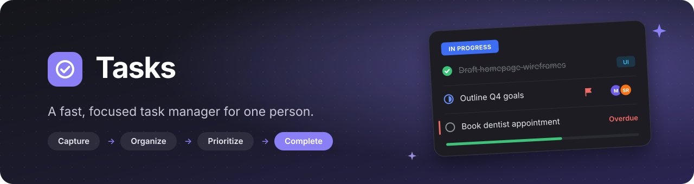
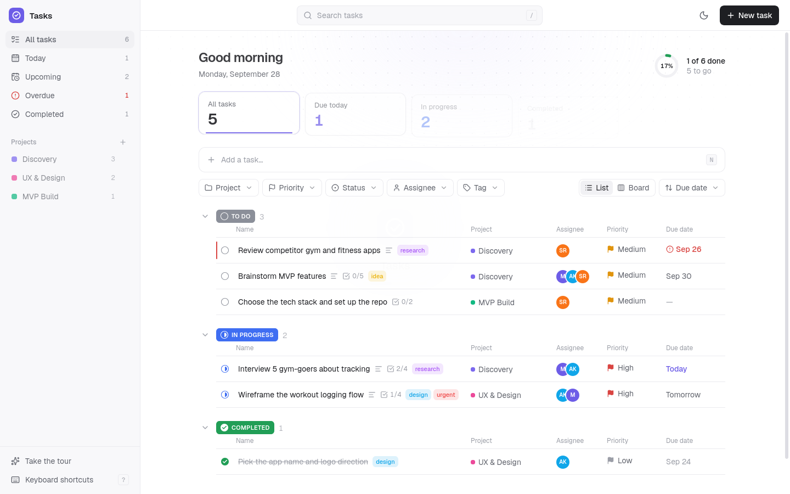
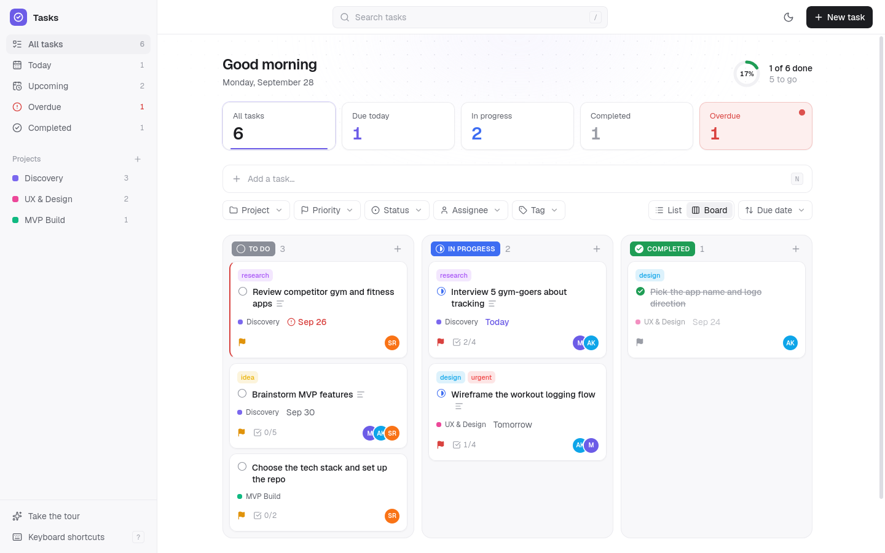
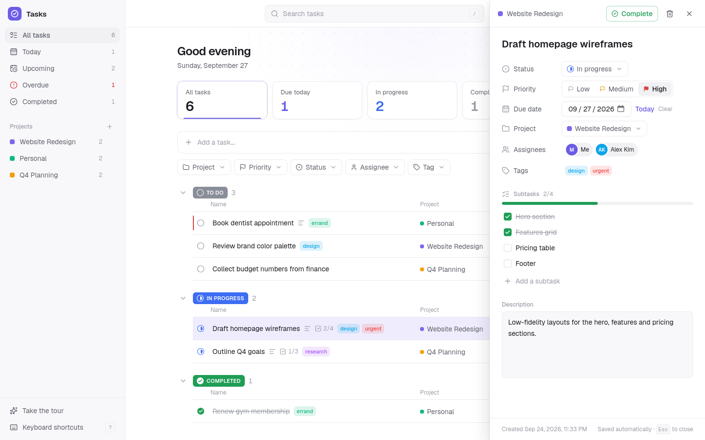
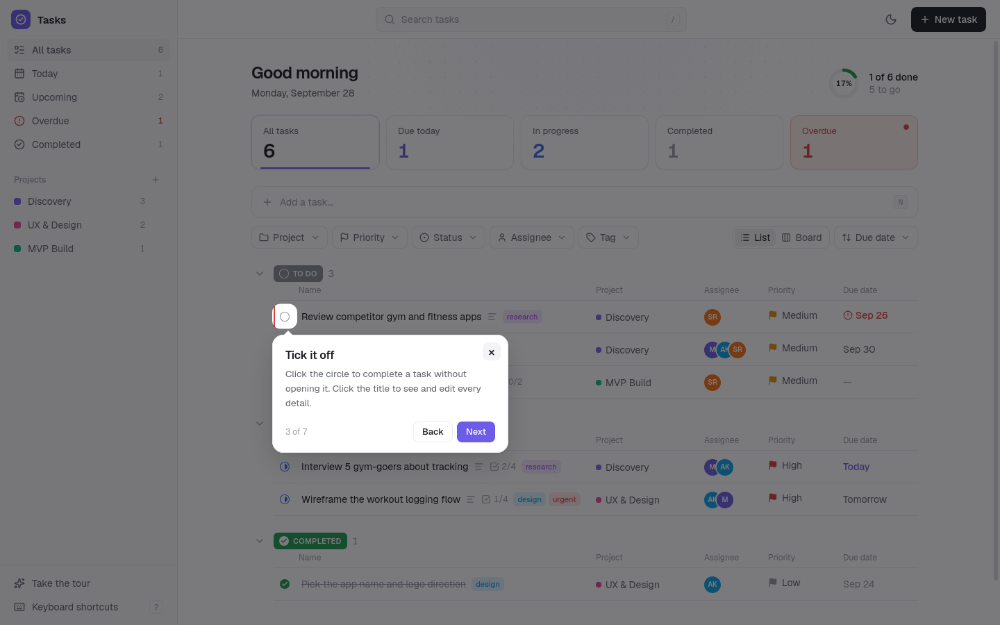
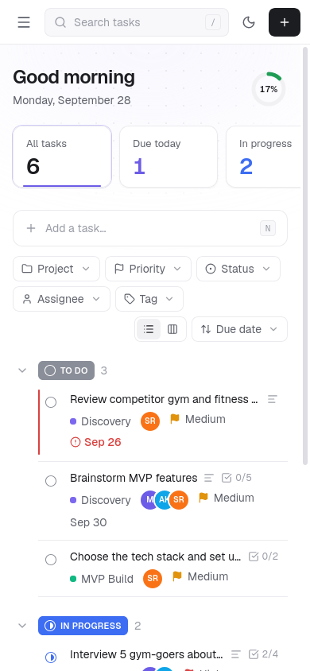
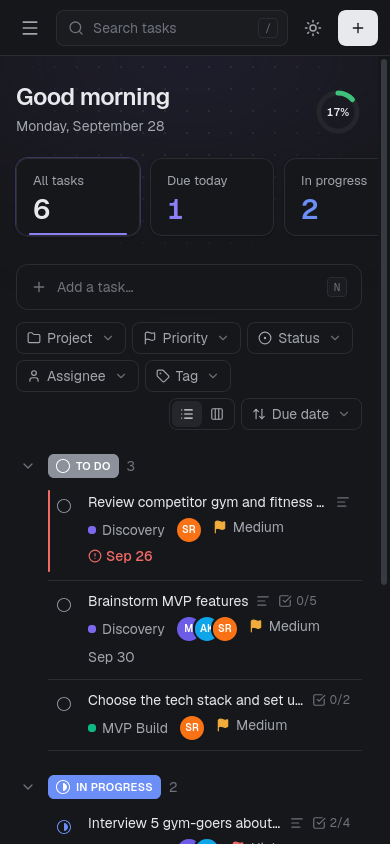

<div align="center">



<br />

**Capture, organize, prioritize and complete your work, all from one calm screen.**
<br />
Single user · Works offline in your browser · Light & dark · Keyboard first

<br />

<a href="https://taskmanager-by-hehehem.vercel.app/"></a>

<br />
<br />


</div>

<br />

<picture>
  <source media="(prefers-color-scheme: dark)" srcset="docs/screenshots/list-dark.png" />
  
</picture>

<br />

## ✨ Highlights

<table>
  <tr>
    <td width="50%" valign="top">
      <h3>⚡ Capture in seconds</h3>
      Press <kbd>N</kbd>, type, hit <kbd>Enter</kbd>. Set priority, due date, project and assignee in the same row without touching the mouse.
    </td>
    <td width="50%" valign="top">
      <h3>✅ Complete from the list</h3>
      Tick the circle and watch it pop, strike through and glide into <em>Completed</em>. Changed your mind? Hit <b>Undo</b> in the toast.
    </td>
  </tr>
  <tr>
    <td valign="top">
      <h3>🗂️ List or Board</h3>
      Grouped list by status, or a Kanban board. Drag cards between columns with mouse, touch or keyboard.
    </td>
    <td valign="top">
      <h3>📊 Your day at a glance</h3>
      Five live counts (all, due today, in progress, completed, overdue) plus a progress ring. Click any card to filter.
    </td>
  </tr>
  <tr>
    <td valign="top">
      <h3>👥 Assignees, tags & subtasks</h3>
      Assign tasks to people (a local list, no accounts), label them with colored tags, and break them down into checklists.
    </td>
    <td valign="top">
      <h3>🧭 Understood in seconds</h3>
      A short guided tour on first visit shows the core moves. Replay it any time from the sidebar.
    </td>
  </tr>
</table>

## 📸 Screenshots

<table>
  <tr>
    <td width="50%">
      <picture>
        <source media="(prefers-color-scheme: dark)" srcset="docs/screenshots/board-dark.png" />
        
      </picture>
      <p align="center"><sub><b>Board view</b>: drag between columns to change status</sub></p>
    </td>
    <td width="50%">
      <picture>
        <source media="(prefers-color-scheme: dark)" srcset="docs/screenshots/drawer-dark.png" />
        
      </picture>
      <p align="center"><sub><b>Task panel</b>: everything editable, saved as you type</sub></p>
    </td>
  </tr>
  <tr>
    <td width="50%">
      
      <p align="center"><sub><b>Guided tour</b>: shown once on first visit</sub></p>
    </td>
    <td width="50%">
      <p align="center">
        
        &nbsp;
        
      </p>
      <p align="center"><sub><b>Mobile</b>: light and dark, equally polished</sub></p>
    </td>
  </tr>
</table>

## 🧩 Features

| Area | What you get |
| --- | --- |
| **Tasks** | Add, edit, delete (always confirmed, with undo), complete or reopen from the list |
| **Fields** | Title, description, due date, priority (low · medium · high), status (to do · in progress · completed), project, created timestamp |
| **Projects** | Create, rename, delete, with a task count for each. Deleting a project keeps its tasks (they become *No project*) |
| **Assignees** | Local list of people with colored avatars; several assignees per task; add people right from the picker |
| **Tags & subtasks** | Colored tags and a per-task checklist with progress (e.g. `2/4`) on rows and cards |
| **Views** | All tasks · Today · Upcoming · Overdue · Completed |
| **Filters & search** | Project, priority, status, assignee, tag. Search matches titles, descriptions, subtasks and tag names |
| **Sort** | Due date · Priority · Created date · A to Z |
| **Feedback** | Toasts for every action, illustrated empty states that say what to do next |
| **Themes** | Light and dark. Follows your system until you choose |
| **Persistence** | Everything lives in `localStorage` and survives a refresh. No server, no sync |
| **Seed data** | 3 projects, 6 tasks, 3 people and 3 tags on first run, dated relative to today |

## ⌨️ Keyboard shortcuts

| Key | Action | | Key | Action |
| :---: | --- | --- | :---: | --- |
| <kbd>N</kbd> | New task | | <kbd>X</kbd> | Complete or reopen |
| <kbd>/</kbd> · <kbd>Ctrl</kbd> <kbd>K</kbd> | Search | | <kbd>Del</kbd> | Delete task |
| <kbd>J</kbd> <kbd>K</kbd> · <kbd>↓</kbd> <kbd>↑</kbd> | Move between tasks | | <kbd>1</kbd>–<kbd>5</kbd> | Switch view |
| <kbd>Enter</kbd> | Open task | | <kbd>B</kbd> | List or board |
| <kbd>Esc</kbd> | Close panel or dialog | | <kbd>?</kbd> | Show all shortcuts |

## 🚀 Getting started

**Requirements:** Node.js 20 or newer.

```bash
git clone https://github.com/HemVaria/Task-manager.git
cd Task-manager
npm install
npm run dev
```

Open **http://localhost:3000**. The app starts with sample data so it never opens empty.

| Command | What it does |
| --- | --- |
| `npm run dev` | Start the dev server with hot reload |
| `npm run build` | Create a production build |
| `npm start` | Serve the production build |
| `npm run lint` | Run ESLint |

> **Tip:** to start fresh, clear this site's data in your browser (DevTools → Application → Local storage).

## 🏗️ How it's built

| Layer | Choice |
| --- | --- |
| Framework | [Next.js 16](https://nextjs.org) (App Router), [React 19](https://react.dev), TypeScript |
| Styling | [Tailwind CSS 4](https://tailwindcss.com) with CSS-variable design tokens for both themes |
| Animation | [Motion](https://motion.dev): springs, layout animations and shared-element transitions |
| Tour | [driver.js](https://driverjs.com), themed to match the app |
| Drag and drop | [dnd-kit](https://dndkit.com), accessible with keyboard and touch sensors |
| Icons | [Lucide](https://lucide.dev) |
| State | A tiny external store on `useSyncExternalStore`, persisted to `localStorage`, synced across tabs |

```
src/
├── app/                 Root layout (fonts, no-flash theme script) and the single page
├── components/
│   ├── task-app.tsx     App shell: views, filters, keyboard shortcuts, dialogs
│   ├── task-list.tsx    Grouped list with animated rows
│   ├── task-board.tsx   Kanban board with drag and drop
│   ├── task-drawer.tsx  Task detail panel (assignees, tags, subtasks)
│   ├── select.tsx       Custom accessible dropdown
│   ├── picker.tsx       Multi-select picker with create/remove
│   ├── graphics.tsx     Illustrations, progress ring, completion burst
│   └── …                Sidebar, dashboard, quick add, toolbar, toasts, dialogs
└── lib/
    ├── store.ts         localStorage store, migrations and all mutations
    ├── tasks.ts         View, filter and sort logic
    ├── seed.ts          First-run sample data
    ├── dates.ts         Local-date helpers (due dates stored as YYYY-MM-DD)
    ├── theme.ts         Light/dark theme
    └── tour.ts          First-run product tour
```

## ♿ Accessibility

- Every action works from the keyboard, with visible focus rings
- Dropdowns, pickers and dialogs use proper ARIA roles and close with <kbd>Esc</kbd>
- Drag and drop announces moves by task name for screen readers
- Animations respect the system *reduce motion* setting

## ☁️ Deploy

**Live:** https://taskmanager-by-hehehem.vercel.app/

Import the repository on [Vercel](https://vercel.com/new), keep the detected Next.js settings and click **Deploy**. Every push to `main` redeploys, and every pull request gets a preview URL.

Data stays in each visitor's browser, so everyone starts from the sample data.

<br />

<div align="center">
<sub>Built by <a href="https://github.com/HemVaria">HemVaria</a></sub>
</div>
